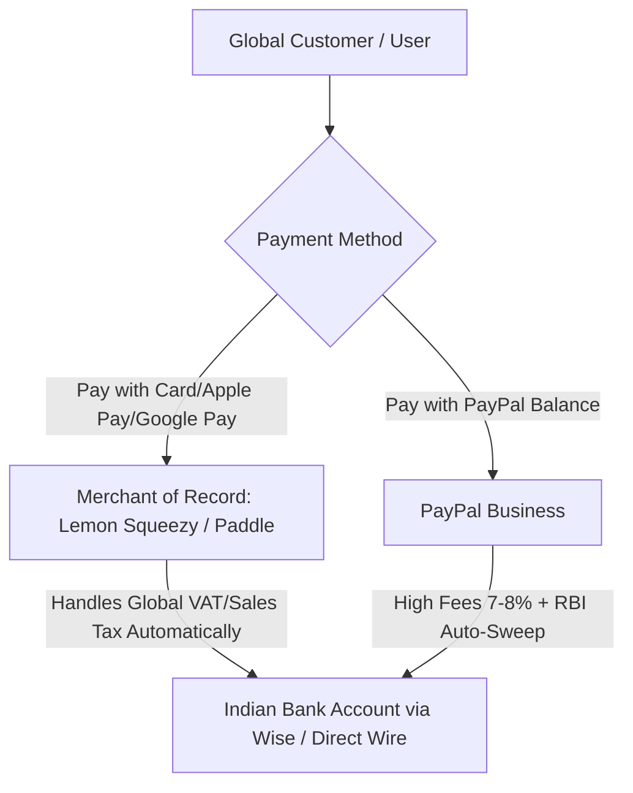
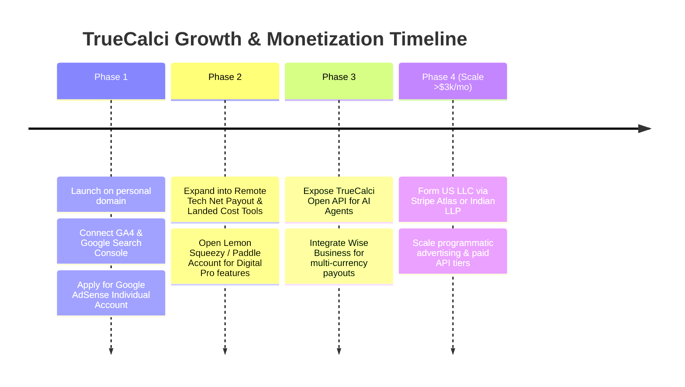

# Strategic Blueprint: Out-of-the-Box Global Niche Revenue Engines, Payment Infrastructure & Legal Setup

A comprehensive, research-backed guide covering:
1. **High-Yield "Boring & Niche" Global Tool Ideas** that individuals and AI agents/LLMs use consistently.
2. **Global Payment Systems Deep-Dive**: Is PayPal enough? PayPal vs. Stripe vs. Merchant of Record (Lemon Squeezy / Paddle).
3. **Legal & Registration Reality**: Exactly what is required in India for Google Analytics, Google Search Console, and Google AdSense monetization (Individual vs. Company).

---

## PART 1: The "Boring & Niche" Global Revenue Opportunities

### Why "Boring & Niche" Software Wins
Big tech companies and VC-funded startups ignore high-utility calculation tools because they look like "unsexy math." However, these exact tools generate **millions of high-intent monthly searches**, carry **industry-leading Google AdSense CPMs ($15 – $55)**, and are **heavily queried by AI agents and LLMs** looking for deterministic calculation ground truth.

Here are 5 out-of-the-box, globally applicable revenue engines engineered to fit right into TrueCalci:

---

### Opportunity 1: [Global Remote Tech & Freelance "Real Take-Home" Matrix](file:///c:/Calculator/opportunities/1_remote_freelance_takehome_matrix/README.md)
*Target Audience: 50M+ remote software engineers, Upwork/Fiverr freelancers, and cross-border contractors.*

* **The Problem**: A developer in Germany, India, Brazil, or Poland gets offered $95,000 USD/year remotely from a US startup via Deel or Remote.com. How much money actually hits their bank account after US W-8BEN withholding, local self-employment tax, platform fees, currency conversion (FX spreads), and health insurance? Nobody gives them a single, deterministic answer.
* **What We Build**:
  - **1099 vs. W-2 vs. B2B Contractor Net Payout Engine**: Compares take-home pay across 15 popular remote tech nations.
  - **FX Drag & Platform Fee Calculator**: Visualizes how much money is lost between Stripe, Deel, Wise, Payoneer, and local bank auto-sweeps.
* **Why AI Agents & LLMs Need It**: LLMs frequently get asked *"Is a $120k contractor offer better than an €85k local employment contract in Berlin?"* LLMs hallucinate local social security tiers and FX margins. An agent can query our clean deterministic engine.
* **Monetization**:
  - **Affiliate CPA**: High-ticket affiliate partnerships with Wise Business, Deel, remote health insurers (SafetyWing pays 10% lifetime recurring), and expat tax advisory CPAs ($100–$300 per booked consultation).
  - **AdSense CPM**: "Expat tax" and "contractor payroll" keywords have an average Google AdSense CPC of **$18 – $35**.

---

### Opportunity 2: [Cross-Border E-Commerce Harmonized Tariff & Landed Cost Engine](file:///c:/Calculator/opportunities/2_ecommerce_landed_cost_tariff_engine/README.md)
*Target Audience: Amazon FBA sellers, Shopify merchants, drop-shippers, and global import/export small businesses.*

* **The Problem**: An e-commerce seller imports 1,000 units of titanium camping mugs or electronics from Vietnam/China to the US, UK, or EU. They get hit with surprise customs duties, harbor maintenance fees, merchandise processing fees (MPF), and anti-dumping tariffs.
* **What We Build**:
  - **True Landed Cost Calculator**: Unit Price + Ocean/Air Freight + Customs Duty (HS Code lookup) + Harbor Fees + Import VAT/GST = True Unit Cost.
  - **Break-Even & Amazon FBA Margin Simulator**: Input selling price, shipping tier, FBA referral fee (15%), storage fee, and output net profit per unit.
* **Why AI Agents & LLMs Need It**: E-commerce automation agents (like AutoGPT, Shopify automated bots) need to programmatically determine whether a product meets a 35% net profit threshold before placing wholesale orders.
* **Monetization**:
  - **Affiliates**: Freight forwarders (Freightos, Flexport), e-commerce banking (Mercury, Payoneer), Amazon analytics tools (Helium 10, Jungle Scout).
  - **SaaS API Tier**: Offer an API (`/api/v1/landed-cost`) where sellers pay $19/month for unlimited programmatic calculations.

---

### Opportunity 3: [Commercial Real Estate (CRE) & NNN Lease Cash-Flow Simulator](file:///c:/Calculator/opportunities/3_cre_triple_net_lease_simulator/README.md)
*Target Audience: Private property investors, retail landlords, franchise operators (Subway, Starbucks, 7-Eleven).*

* **The Problem**: Residential mortgage calculators are everywhere, but **Commercial Real Estate (CRE)** is underserved. Investors evaluating retail shops, warehouses, and medical clinics need **Cap Rate**, **Net Operating Income (NOI)**, **Debt Service Coverage Ratio (DSCR)**, and **Triple Net (NNN) Lease vs. Gross Lease** calculations.
* **What We Build**:
  - **Cap Rate & Cash-on-Cash Return Calculator**.
  - **Triple Net (NNN) Lease Allocator**: Divides property taxes, building insurance, and common area maintenance (CAM charges) across commercial tenants by square footage.
  - **DSCR Loan Eligibility Checker**: Tells the buyer if their net rental income satisfies commercial bank underwriting (typically minimum 1.25x DSCR).
* **Why It’s Extremely Lucrative**:
  - Commercial real estate leads have the **highest CPMs on the internet** ($45 – $90 CPM on Google AdSense).
  - Mortgage brokers and commercial hard-money lenders pay $500–$1,500 for a qualified commercial borrowing lead.

---

### Opportunity 4: [Global Digital Nomad & Expat Tax Exclusion (FEIE / 183-Day Rule) Tracker](file:///c:/Calculator/opportunities/4_digital_nomad_feie_tax_tracker/README.md)
*Target Audience: 35M+ digital nomads, traveling professionals, and international expats.*

* **The Problem**: Digital nomads risk accidental tax residency and double taxation. US citizens abroad need to calculate the **Foreign Earned Income Exclusion (FEIE - Form 2555)** which requires passing the **330-day Physical Presence Test**. European and UK citizens must track the **183-Day Statutory Residence Test** to avoid tax audits.
* **What We Build**:
  - **Physical Presence & Tax Residency Day Counter**: Input departure and arrival dates across countries; it calculates whether you qualify for the $126,500 (2024–2026 inflation-adjusted) tax exemption.
  - **Dual-Country Tax Treaty Arbitrage**: Shows tax liability between home country and host country (e.g., Portugal, Dubai, Thailand, Bali).
* **Monetization**:
  - Expat CPA referrals (Greenback Expat Tax, Taxes for Expats) pay **$200+ per lead**.
  - Nomad health insurance (Genki, SafetyWing) and VPN affiliate integration.

---

### Opportunity 5: [The "TrueCalci Open AI Agent API" (Model-Context-Protocol / LLM Tool Spec)](file:///c:/Calculator/opportunities/5_truecalci_open_ai_agent_api/README.md)
*Target Audience: AI Developers, Claude Artifacts, ChatGPT Custom GPTs, and LangChain/LlamaIndex agents.*

* **The Breakthrough Insight**: LLMs (GPT-4o, Claude 3.5 Sonnet, Gemini 2.0) are notoriously bad at precise financial arithmetic, amortization schedules, and regional tax brackets.
* **What We Build**:
  - Expose TrueCalci’s calculation engines as a free and premium **Open Tool Protocol**:
    - `https://truecalci.com/api/v1/mortgage?price=450000&down=20&rate=6.8`
    - `https://truecalci.com/api/v1/tax?income=1500000&regime=new`
  - Provide an `openapi.json` and a standard **Model Context Protocol (MCP)** manifest.
* **Why This Explodes Growth**:
  - AI developers connect TrueCalci to their custom chatbots and financial bots as the "source of truth".
  - Millions of API calls generate recurring API subscription revenue ($9 – $29/mo for developer API keys).

---

## PART 2: Global Payment Infrastructure — Is PayPal Enough?

The short answer: **No, PayPal alone is NOT enough for global software monetization, but it is a useful secondary option.**

Here is the complete comparative breakdown of how global software developers monetize from India:

### 1. PayPal (The Reality from India)
* **How It Works**: You open a PayPal India Business/Individual account, link your Indian savings bank account and PAN card.
* **The Good**: Trusted by older US/European consumers; easy initial setup.
* **The Bad (Critical Bottlenecks)**:
  - **Exorbitant Fees**: 4.4% transaction fee + $0.30 fixed fee + 3.5% currency conversion spread = **~7.5% to 8% total fee loss** on every dollar!
  - **RBI Daily Auto-Sweep Rule**: In India, the Reserve Bank of India (RBI) mandates that all PayPal foreign currency balances must be converted to INR and auto-withdrawn to your Indian bank within 24–48 hours. You cannot hold USD in PayPal to pay for your server costs.
  - **Account Freeze Risk**: PayPal's automated risk algorithms frequently freeze accounts with sudden spikes in revenue for 180 days.
  - **Cart Abandonment**: Over 70% of tech-savvy customers prefer paying with Apple Pay, Google Pay, or direct Credit Card, which PayPal's standard flow makes clunky.

---

### 2. The Modern Gold Standard: Merchant of Record (MoR)
*(Lemon Squeezy, Paddle, or FastSpring)*

If you plan to sell digital tools, premium calculator features, or API access to global users, **you should use a Merchant of Record (MoR)** like **Lemon Squeezy** (now part of Stripe) or **Paddle**.

#### Why an MoR is a Game-Changer for an Indian Founder:
* **The "Tax Nightmare" Solved**: If you sell software to a customer in France, you legally owe French VAT (20%). If you sell to a customer in Texas, you owe Texas Sales Tax (8.25%). As an individual in India, registering for tax in 50 US states and 27 EU nations is virtually impossible.
* **How MoR Solves It**: The MoR acts as the legal reseller of your software. **They collect, remit, and file all global sales tax and European VAT under their own corporate entity.**
* **Supported Payment Methods**: Customers can pay with **Apple Pay, Google Pay, Visa, Mastercard, American Express, and PayPal** through a single checkout.
* **Payouts to India**: They consolidate your earnings and pay you directly to your Indian bank account via **Wise** or Wire Transfer with minimal foreign exchange fees (typically ~1.5% fee loss vs. PayPal’s 8%).
* **Registration**: You can sign up as an individual in India with just your personal PAN card.

---

### 3. Stripe (Direct Card Processing)
* **Direct Stripe India**: Currently operates with invitation-only onboarding for Indian sole proprietorships due to recurring RBI mandate changes for recurring card storage.
* **Stripe Atlas Alternative**: When your software hits $2,000 – $5,000/month, many Indian developers establish a **US Delaware LLC via Stripe Atlas ($500 one-time fee)**. This grants you a full US business entity, a US Mercury bank account, and unrestricted access to global Stripe with 0% currency conversion drag.

---

## PART 3: Legal & Regulatory Requirements in India

### 1. Google Analytics 4 (GA4)
* **Company Required?**: **NO. Absolutely NOT.**
* **Requirements**: Any standard personal `@gmail.com` account.
* **Process**: Log in to analytics.google.com, create an account name (e.g., "TrueCalci"), generate your `G-XXXXXXXXXX` measurement ID, and paste it into `js/config.js`.
* **Cost**: 100% Free forever.

---

### 2. Google Search Console (GSC)
* **Company Required?**: **NO. Absolutely NOT.**
* **Requirements**: Your personal `@gmail.com` account.
* **Process**: Go to search.google.com/search-console, add your website property (`truecalci.com` or domain), verify ownership via the HTML meta tag we already installed, and submit your `sitemap.xml`.
* **Cost**: 100% Free.

---

### 3. Google AdSense (Monetization & Ad Payouts)
* **Company Required?**: **NO. 100% Legal as an Individual.**
* **Account Type to Choose**: **Individual Account** (Do NOT choose "Business").
* **What Google Requires from You in India**:
  1. **Your Full Legal Name** (exactly matching your Indian Government ID).
  2. **Indian PAN Card** (Personal Permanent Account Number) for tax identity verification.
  3. **Postal Address**: Google will mail an envelope containing a physical 6-digit PIN to your Indian home address to verify your physical presence.
  4. **Indian Bank Account**: Any regular Indian savings bank account (HDFC, SBI, ICICI, Axis, etc.) with its **SWIFT / BIC Code** for direct Wire Transfer (NEFT/RTGS wire payout in INR).
  5. **US Tax Form (W-8BEN)**: Filled out in 2 minutes directly inside the AdSense dashboard. Because India has a Double Taxation Avoidance Agreement (DTAA) with the United States, your withholding tax on US earnings is reduced to 0% – 15%.

#### Indian Tax & GST Regulations (Clear Facts):
* Under **Section 22 of the Indian Central Goods and Services Tax (CGST) Act**:
  - GST registration is **NOT required** until your aggregate annual turnover from software/services exceeds **₹20 Lakhs** (or ₹10 Lakhs in Special Category States).
  - Below ₹20 Lakhs/year, you operate 100% legally as an individual / sole proprietor using only your personal PAN card.
  - All earnings received from Google AdSense or software sales are simply reported under "Income from Business/Profession" or "Income from Other Sources" in your standard annual ITR-3 / ITR-4 tax return.

---

## PART 4: Recommended Action Roadmap

1. **Immediate (Next 7 Days)**:
   - Deploy TrueCalci to production.
   - Verify Google Search Console with the meta tag already in `index.html`.
   - Connect Google Analytics 4 using your personal Gmail.
   - Submit for Google AdSense under an **Individual** payee profile.
2. **Short-Term (Month 1 – 2)**:
   - Build the **Remote Worker Net Take-Home & FX Drag Matrix** and **Landed Cost Engine** to capture high-ticket global search traffic.
   - Set up an account on **Lemon Squeezy** or **Paddle** for selling premium PDF amortization exports or pro calculation tools (Apple Pay + Cards handled).
3. **Medium-Term (Month 3+)**:
   - Expose the TrueCalci calculation endpoints as an **AI Agent Tool (MCP / OpenAI Actions)**, positioning TrueCalci as the premier computational API for LLMs.
