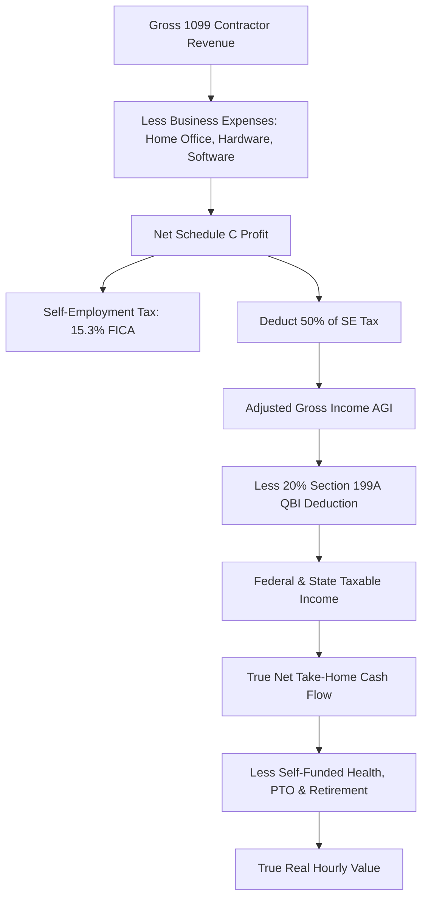

# Opportunity 1: Global Remote Tech & Freelance "Real Take-Home" Matrix

> **1099 vs. W-2 vs. B2B Pass-Through Tax, FX Drag & Benefits Parity Simulator**

---

## 1. Market Research & Real-World Search Demand

### What Real Developers & Contractors Are Searching For:
Every day, thousands of remote tech workers search queries like:
- *"1099 vs W2 calculator take home pay after taxes"*
- *"Is $100/hr 1099 equivalent to $150k W2 salary?"*
- *"Remote contractor US startup taxes from Germany / UK / India"*
- *"Deel vs Wise vs Payoneer currency conversion fees for contractors"*
- *"How much should I charge as a 1099 contractor to match W2 benefits?"*

### The Pain Point & Reddit/Hacker News Consensus:
On forums like `r/freelance`, `r/cscareerquestions`, and Hacker News, the most common dilemma is:
> *"A US company offered me a remote role as a 1099 independent contractor at $85/hr, or a W-2 salary of $130,000/year with benefits. Which one leaves more money in my pocket?"*

Standard calculators online fail because they only look at federal tax. They **ignore**:
1. **The 15.3% Self-Employment Tax** burden (FICA).
2. **The 20% Section 199A Qualified Business Income (QBI) deduction** available to pass-through entities and sole proprietors.
3. **The hidden cost of funding your own benefits** (health insurance, 401(k) match, paid time off).
4. **Cross-border currency conversion (FX) spreads** charged by platforms like Deel, Upwork, or local banks (which silently shave 2% to 4% off every payment).

---

## 2. The Core Mathematical Formulas

### A. US Self-Employment Tax (SE Tax / FICA):
$$\text{SE Tax} = \text{Net Profit} \times 0.9235 \times 0.153$$
- **12.4% Social Security** on earnings up to the annual wage base cap ($168,600).
- **2.9% Medicare** on all net earnings without cap (plus 0.9% additional Medicare on earnings over $200,000 single / $250,000 married).
- **Half-SE Deduction**: Exactly 50% of the calculated SE Tax is deducted from total income before calculating federal income tax.

### B. Section 199A Qualified Business Income (QBI) Deduction:
$$\text{QBI Deduction} = 0.20 \times (\text{Net Business Profit} - \text{50% SE Tax} - \text{Health Insurance Premiums})$$
*This powerful 20% tax deduction lowers the contractor's effective federal tax rate significantly below employee rates on identical taxable income.*

### C. W-2 Benefits Parity Multiplier:
To make an equivalent comparison, the tool values standard corporate benefits:
- **Employer FICA Match**: $7.65\%$ of salary.
- **Employer 401(k) Match**: Typically $3\% \text{ to } 5\%$.
- **Health / Dental Insurance Subsidy**: $\approx \$6,000 \text{ to } \$12,000/\text{year}$.
- **Paid Time Off (PTO - 15 days + 10 holidays)**: $\approx 9.6\%$ of annual base rate.
- **Rule of Thumb Formula**:
$$\text{Equivalent 1099 Hourly Rate} = \frac{\text{W-2 Annual Salary}}{2080} \times 1.28 \text{ to } 1.35$$

### D. Cross-Border FX Drag & Payout Matrix:
For international remote workers paid in USD:
$$\text{Net Local Currency} = (\text{USD Payment} - \text{Platform Fee}) \times (\text{Mid-Market FX Rate} \times (1 - \text{FX Markup}))$$
- **Stripe**: 1% cross-border + 2% FX markup.
- **PayPal**: 4.4% transaction fee + 3.5% currency spread.
- **Wise Business**: Flat 0.45% – 0.65% mid-market conversion fee.

---

## 3. UI/UX Architecture for TrueCalci

* **Dual-Column Comparative Sliders**:
  - Left Card: **W-2 Salaried Role** (Salary, Health Insurance Value, 401k Match, PTO Days).
  - Right Card: **1099 / B2B Contractor** (Hourly Rate, Estimated Billable Hours, Annual Expenses, QBI eligibility).
* **Live "Parity Verdict" Indicator**:
  - Automatically highlights which offer yields more spendable cash per month:
    `🎉 The 1099 offer yields +$1,140/mo more spendable cash after taxes & expenses!`
* **Visual Waterfall Chart**:
  - Compares: Gross $\to$ Taxes $\to$ Benefits $\to$ Net Cash $\to$ Real Take-Home.

---

## 4. Monetization & CPA Economics

| Revenue Stream | Provider / Partner | Payout / CPM |
| :--- | :--- | :--- |
| **Expat / Contractor Tax CPAs** | Greenback Tax, Taxes for Expats, 1-800Accountant | **$150 – $300 per consultation lead** |
| **Cross-Border Payout Rail** | Wise Business, Payoneer | **$50 – $100 per business signup** |
| **Nomad & Freelance Health** | SafetyWing Remote Health | **10% lifetime monthly recurring revenue** |
| **Google AdSense B2B CPM** | Keywords: "1099 tax calculator", "contractor payroll" | **$18 – $35 CPM** |
