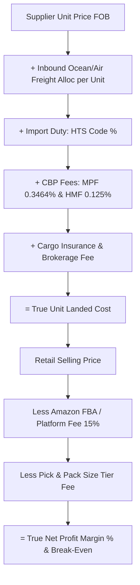

# Opportunity 2: Cross-Border E-Commerce Landed Cost & Harmonized Tariff Engine

> **Amazon FBA, Shopify DTC & Global Import Duty, Freight & True Profit Margin Simulator**

---

## 1. Market Research & Real-World Search Demand

### What E-Commerce Sellers Are Searching For:
Every day, over 2.5 million global cross-border e-commerce merchants search queries like:
- *"How to calculate true landed cost per unit Amazon FBA"*
- *"Import duty calculator China to US / UK"*
- *"HTS code duty rate calculator electronics / apparel"*
- *"Merchandise Processing Fee MPF calculation US customs"*
- *"Shopify landed cost calculator with duties and shipping"*

### The Pain Point & Seller Community Sentiment:
On Reddit (`r/FulfillmentByAmazon`, `r/ecommerce`, `r/shopify`), the #1 reason first-year sellers go bankrupt is **unaccounted landed costs**:
> *"I sourced a kitchen gadget for $4.00 from Alibaba and sold it on Amazon for $18.99 thinking I was making a 78% gross margin. After ocean freight, customs tariffs, harbor maintenance fees, customs broker clearance, and Amazon FBA pick-and-pack fees, my true cost was $15.50 per unit. I was actually losing money on PPC ads!"*

Traditional landed cost calculators online are either:
1. Clunky enterprise software costing $500/mo (Zonos, Landara).
2. Basic spreadsheets that don't compute mandatory customs fees (MPF, HMF) or Amazon size-tier fulfillment fees.

---

## 2. The Core Mathematical Formulas

### A. True Unit Landed Cost Formula:
$$\text{Landed Cost per Unit} = \text{FOB Unit Price} + \frac{\text{Total Freight}}{\text{Total Units}} + \text{Unit Duty} + \frac{\text{Customs Clearance Fees}}{\text{Total Units}} + \text{Unit Insurance}$$

### B. US Customs Statutory Fees (CBP Rules):
1. **Import Duty**:
   $$\text{Duty} = \text{Commercial Value (FOB)} \times \text{Tariff Rate (HS Code)}$$
2. **Merchandise Processing Fee (MPF)**:
   - Statutory rate: $0.3464\%$ of FOB commercial value.
   - Statutory bounds: Minimum **$31.67**, Maximum **$614.35** per formal entry shipment.
3. **Harbor Maintenance Fee (HMF)** (Ocean shipments only):
   - Flat $0.125\%$ of commercial cargo value.

### C. Amazon FBA & Platform Unit Economics:
$$\text{Net Profit per Unit} = \text{Selling Price} - \text{Landed Cost} - \text{Referral Fee (15%)} - \text{FBA Pick/Pack Fee} - \text{Monthly Storage per Unit}$$
$$\text{Net Margin \%} = \frac{\text{Net Profit}}{\text{Selling Price}} \times 100$$
$$\text{Break-Even Selling Price} = \frac{\text{Landed Cost} + \text{FBA Pick/Pack Fee}}{1 - \text{Referral Fee Rate (0.15)}}$$

---

## 3. UI/UX Architecture for TrueCalci

* **Visual "Container Load & Unit Breakdown" Visualizer**:
  - Live progress bar showing the composition of each dollar:
    `[ Product Cost: 42% | Freight: 24% | Duty/Taxes: 18% | Amazon FBA: 16% ]`
* **Shipping Mode Selector**:
  - 🚢 **Ocean FCL (Full Container)** vs. **LCL (Shared CBM)** vs. ✈️ **Air Express (DHL/FedEx per kg)**.
* **Instant Margin Gauge**:
  - Red / Amber / Green visual gauge showing if the net margin meets the industry survival threshold ($\ge 30\%$ Net Margin).

---

## 4. Monetization & Partner Revenue

| Revenue Stream | Partner / Provider | Payout / CPM |
| :--- | :--- | :--- |
| **Freight Forwarders** | Freightos, Flexport | **$50 – $150 per freight booking lead** |
| **E-Commerce Banking** | Mercury Bank, Wise Business, Payoneer | **$100 per funded corporate account** |
| **Amazon Seller Software** | Helium 10, Jungle Scout | **25% – 30% recurring monthly affiliate commission** |
| **Google AdSense B2B CPM** | Keywords: "import duty calculator", "amazon fba fee calculator" | **$22 – $40 CPM** |
