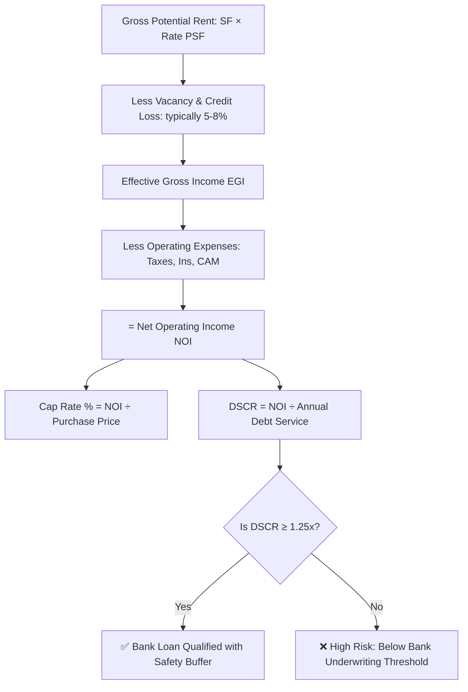

# Opportunity 3: Commercial Real Estate (CRE) & Triple Net (NNN) Lease Simulator

> **Cap Rate, Net Operating Income (NOI), DSCR Loan Eligibility & NNN Lease Allocator**

---

## 1. Market Research & High-CPM Real Estate Demand

### What Commercial Real Estate Investors & Brokers Are Searching For:
Commercial real estate professionals and private investors search queries like:
- *"Triple net lease NNN calculator per square foot"*
- *"DSCR calculator commercial real estate lender requirements"*
- *"Cap rate calculator commercial property cash on cash return"*
- *"NNN vs gross lease calculator for retail tenant"*
- *"Common Area Maintenance CAM reconciliation calculator"*

### Why This Is the Highest AdSense CPM Niche on the Internet:
In digital advertising, **Commercial Real Estate (CRE) commands the highest Google AdSense CPMs in the world ($45 – $90+ CPM)**. Why?
- The transaction sizes are multi-million dollar deals ($2M to $25M+).
- Commercial lenders (JPMorgan Chase Commercial, Wells Fargo, private hard-money debt funds) and 1031 exchange facilitators are willing to bid **$50 to $120 per click** on Google Ads to capture borrowing leads.
- A single commercial mortgage lead is worth **$500 to $1,500** to a commercial debt broker.

---

## 2. The Core Mathematical Formulas

### A. Net Operating Income (NOI):
$$\text{NOI} = \text{Effective Gross Income (EGI)} - \text{Operating Expenses}$$
*(Note: Operating expenses exclude debt service/mortgage interest and depreciation).*

### B. Capitalization Rate (Cap Rate) & Property Valuation:
$$\text{Cap Rate} = \frac{\text{NOI}}{\text{Property Value / Purchase Price}} \times 100$$
$$\text{Implied Property Value} = \frac{\text{NOI}}{\text{Market Cap Rate}}$$

### C. Debt Service Coverage Ratio (DSCR):
$$\text{DSCR} = \frac{\text{Net Operating Income (NOI)}}{\text{Annual Principal \& Interest Debt Service}}$$
* **DSCR < 1.0**: Cash flow negative (property cannot cover loan payments).
* **DSCR = 1.0**: Exact break-even.
* **DSCR $\ge$ 1.25**: Standard commercial lender minimum requirement.

### D. Triple Net (NNN) Monthly Lease Rent Allocation:
$$\text{Monthly Tenant Payment} = \frac{(\text{Base Rent PSF} + \text{Taxes PSF} + \text{Insurance PSF} + \text{CAM PSF}) \times \text{Tenant Square Feet}}{12}$$

---

## 3. UI/UX Architecture for TrueCalci

* **Executive Underwriting Summary Card**:
  - Highlights the Big Three metrics side-by-side:
    1. **Cap Rate**: (e.g., `6.45%`)
    2. **Cash-on-Cash Return**: (e.g., `8.82%`)
    3. **DSCR Ratio**: (e.g., `1.34x` with visual green checkmark `Bank Underwriting Approved`)
* **Interactive Square Footage & Expense Allocator**:
  - Allows landlords and tenants to input building SF and tenant SF to calculate exact monthly CAM/Tax shares.
* **Sensitivity Table**:
  - Shows how property valuation changes if the Cap Rate expands or compresses by $\pm 50$ basis points (bps).

---

## 4. Monetization & High-Ticket Lead Generation

| Revenue Stream | Partner / Provider | Payout / CPM |
| :--- | :--- | :--- |
| **Commercial Loan Lead Referrals** | Commercial Lending Networks (LendingTree Commercial, Lev Capital) | **$500 – $1,500 per qualified commercial debt lead** |
| **1031 Exchange Intermediaries** | IPX1031, First American Exchange | **$250 – $500 per exchange consultation** |
| **CRE Property Data Platforms** | LoopNet, Crexi, PropStream | **$50 – $100 per free trial signup** |
| **Google AdSense Ultra-High CPM** | Keywords: "dscr calculator commercial", "triple net lease calculator" | **$45 – $90 CPM** |
