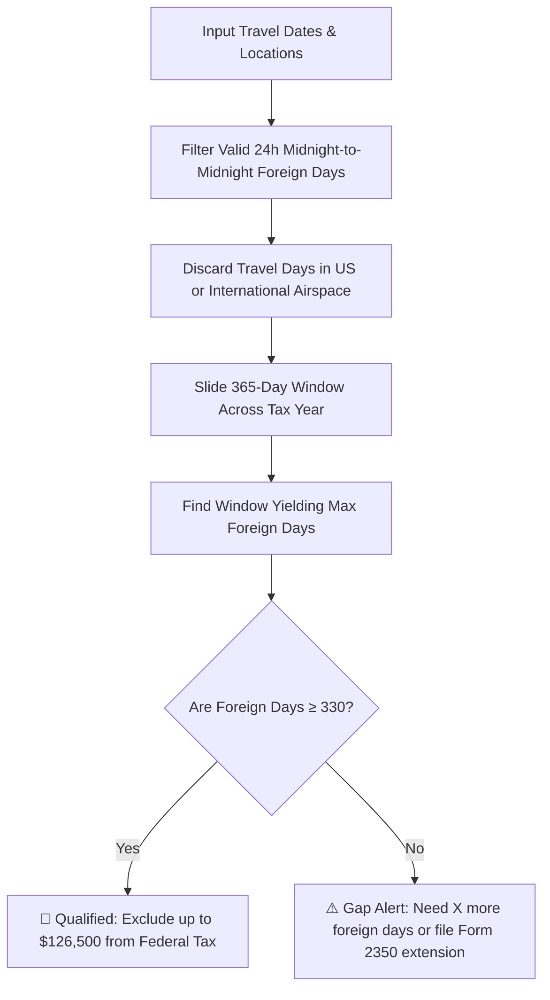

# Opportunity 4: Digital Nomad 330-Day Physical Presence & Foreign Earned Income (FEIE) Tax Tracker

> **IRS Form 2555 Physical Presence Test, Rolling 12-Month Window Optimizer & 183-Day Residency Tracker**

---

## 1. Market Research & Global Expat Search Demand

### What Digital Nomads & Expats Are Searching For:
Over 35 million digital nomads and 9 million US citizens living abroad search queries like:
- *"Physical presence test calculator 330 full days form 2555"*
- *"How to count 330 days for foreign earned income exclusion"*
- *"Can travel days count towards FEIE 330 days IRS"*
- *"183 day rule calculator tax residency digital nomad"*
- *"Schengen 90 180 day rolling calculator"*

### The High-Stakes Expat Dilemma:
The IRS Foreign Earned Income Exclusion (FEIE) allows qualifying Americans living abroad to exclude up to **$126,500 (2024–2026 inflation-adjusted to ~$130,000)** of foreign earned income from federal income taxes. 

However, the IRS has ruthless audit rules:
1. **The 330 Full Days Rule**: You must be physically present in a foreign country for at least **330 full days (24-hour midnight-to-midnight periods)** during any rolling **12 consecutive months**.
2. **The Travel Day Trap**: If your flight departs London at 10 PM and arrives in Singapore the next morning, that day **does NOT count as a foreign day** because part of it was spent over international airspace! Missing the threshold by just **1 day** results in a retroactive tax bill of **$25,000 – $40,000**!
3. **Rolling Window Optimization**: The 12-month period does not need to match January 1 to December 31. An intelligent tool can slide the 365-day window forward or backward by weeks to capture the maximum qualifying foreign days.

---

## 2. The Core Mathematical Formulas & Logic

### A. The 330 Full Days Calculation Algorithm:
$$\text{Eligible Day} = 
\begin{cases} 
1 & \text{if full 24h period (00:00 to 23:59) spent on foreign soil} \\ 
0 & \text{if any part of the 24h period was spent in the US or transit over international waters/airspace} 
\end{cases}$$

### B. Rolling 12-Month Sliding Window Maximizer:
For any chosen start date $d$, the window spans $[d, d + 365 \text{ days}]$:
$$\text{Max Foreign Days} = \max_{d \in \text{Tax Year}} \sum_{t = d}^{d + 365} \text{Eligible Day}(t)$$

### C. Tax Savings Output:
$$\text{Estimated Federal Tax Saved} \approx \min(\text{Earned Income}, \text{FEIE Cap}) \times \text{Effective Federal Marginal Rate (22\% - 32\%)}$$
*(Typically **$22,000 to $35,000 in cash tax savings** for qualifying taxpayers).*

### D. Schengen 90 / 180 Rolling Visa Calculator:
For nomads traveling in Europe:
$$\text{Days Spent in Schengen} = \sum_{t = \text{Today} - 179}^{\text{Today}} \text{DayInSchengen}(t) \le 90$$

---

## 3. UI/UX Architecture for TrueCalci

* **Interactive Trip Logger & Calendar**:
  - Quick input table: `[ Date Departed | Country Left | Date Arrived | Destination Country ]`.
  - Automatically flags flight transit days with warning icons (`✈️ In transit: Day does not qualify under IRS 24h rule`).
* **Live "Days Remaining" Counter**:
  - Circular progress ring: `[ 312 / 330 Days Completed | 18 Days to Safety ]`.
* **IRS Form 2555 Extension (Form 2350) Recommender**:
  - If a user is at 290 days when April 15 arrives, the tool outputs an automated prompt:
    `💡 You qualify for Form 2350 extension until you hit 330 days. Download the pre-filled extension guide.`

---

## 4. Monetization & High-Ticket CPA Economics

| Revenue Stream | Partner / Provider | Payout / CPM |
| :--- | :--- | :--- |
| **Expat Tax Return Preparation** | Taxes for Expats, MyExpatTaxes, Greenback Tax | **$150 – $300 per booked return** |
| **Nomad Global Health Insurance** | SafetyWing Nomad Insurance, Genki, World Nomads | **10% – 15% monthly recurring commission** |
| **Expat Banking & Multi-Currency** | Wise Business, Revolut Global | **$30 – $75 per verified account** |
| **Google AdSense Expat CPM** | Keywords: "physical presence test calculator", "feie form 2555" | **$25 – $48 CPM** |
