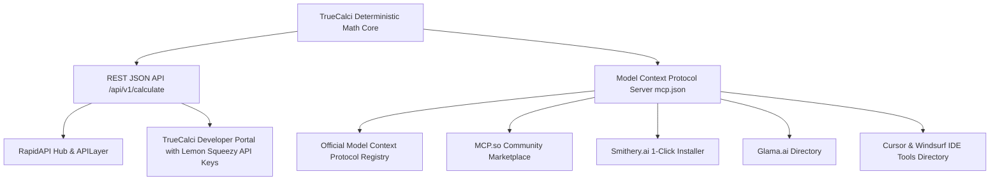

# Opportunity 5: TrueCalci Open AI Agent API & Model Context Protocol (MCP) Connector

> **Master Architecture, Distribution, Sales Channels & Monetization Blueprint for AI Agents and LLMs**

---

## 1. Executive Summary & Core Premise

Large Language Models (**GPT-4o, Claude 3.5 Sonnet, Claude 3.7 Sonnet, Gemini 2.0 Flash/Pro, DeepSeek-R1**) possess advanced reasoning capabilities, but they are fundamentally probabilistic text-prediction engines. When tasked with:
- Multi-tier progressive tax brackets (e.g., Indian New Tax Regime Section 87A marginal rebate).
- 30-year fixed mortgage amortization schedules with Private Mortgage Insurance (PMI) drop-off thresholds.
- European VAT reverse extraction ($Gross \to Net$) with country-specific standard vs reduced rates.
- Numerical integration ($\int_a^b f(x) dx$) and non-linear polynomial root-finding ($ax^2 + bx + c = 0$).

...**they hallucinate or approximate numbers**.

**TrueCalci's Opportunity**: Convert TrueCalci's deterministic, battle-tested JavaScript/Node calculation engines into an **Open AI Agent API** and an **Official Model Context Protocol (MCP) Server**. 

---

## 2. Model Lineup Reality Check (2025 – 2026 Ecosystem)

As noted, older models have been retired or superseded. Below is the active production lineup:

| Provider | Active Flagship Models (2025–2026) | Deprecated / Phased Out Models | Tool Calling Protocol |
| :--- | :--- | :--- | :--- |
| **Anthropic** | **Claude 3.7 Sonnet**, **Claude 3.5 Sonnet**, Claude 3.5 Haiku | Claude 1.x, Claude 2.0, Claude 2.1, Claude 3.0 Opus (legacy) | **Model Context Protocol (MCP)**, Tools API |
| **OpenAI** | **GPT-4o**, **GPT-4o-mini**, **o1**, **o3-mini** | GPT-3.5-Turbo (phased out), GPT-4 (0613 legacy), InstructGPT | Function Calling / Tool Definitions |
| **Google** | **Gemini 2.0 Flash**, **Gemini 2.0 Pro**, Gemini 1.5 Pro | PaLM 2, Gemini 1.0 Pro | Gemini Function Declaration |
| **DeepSeek** | **DeepSeek-V3**, **DeepSeek-R1** | DeepSeek-LLM 67B | OpenAI-compatible Tool Calling |

**Key Takeaway**: All leading models in 2025/2026 share two standard tool-calling paradigms:
1. **OpenAI-Compatible Tool Calling (`tools` schema in JSON Schema format)**.
2. **Anthropic’s Model Context Protocol (MCP)** — the open standard that connects local and remote tools to Claude Desktop, Cursor, Windsurf, and autonomous agent frameworks.

---

## 3. Where, How, and To Whom Do We Sell the TrueCalci API?

### A. To Whom Do We Sell? (Target Buyer Personas)

1. **Fintech & Proptech Startups (B2B SaaS)**:
   - Building financial advisory chatbots, mortgage pre-approval bots, and tax planning assistants.
   - They do not want to spend 6 months engineering and maintaining local tax brackets, Indian Budget amendments, and US PMI rules. They buy an API key for $29/mo.
2. **AI Agent Developers (Cursor / Windsurf / LangChain / CrewAI builders)**:
   - Autonomous agents executing complex multi-step financial plans need a reliable "calculator tool."
3. **Cross-Border Accounting & E-Commerce Firms**:
   - Programmatic invoice processors requiring instant VAT verification and landed cost math.
4. **Autonomous AI Agents (M2M - Machine-to-Machine Commerce)**:
   - In 2025/2026, autonomous agents with delegated corporate credit cards or wallet budgets purchase API tool access directly.

---

### B. Where Do We Distribute & List the API? (Discovery Marketplaces)



1. **The Official Model Context Protocol (MCP) Registry** (`registry.modelcontextprotocol.io`):
   - The authoritative catalog created by Anthropic. Having `truecalci-mcp-server` listed here gives instant credibility and discovery across all Claude Desktop users worldwide.
2. **Smithery.ai & Glama.ai**:
   - The leading 1-click registries for installing tools into Claude Desktop and Cursor with a single terminal command:
     `npx -y @smithery/cli install truecalci-mcp`
3. **MCP.so & Awesome-MCP-Servers** (`mcpservers.org`):
   - High-traffic community directories indexed heavily by Google and AI search bots.
4. **RapidAPI (Now API Hub)**:
   - The world’s largest public API marketplace (over 4 million developers). Listing TrueCalci under "Finance" and "Calculators" immediately exposes it to global software builders with built-in subscription billing.
5. **Direct Developer Portal (`truecalci.com/developers`)**:
   - Host OpenAPI documentation (`/docs`), an interactive playground, and self-serve API key purchasing via **Lemon Squeezy**.

---

### C. Pricing & Monetization Architecture

| Tier | Price | Monthly Quota | Features |
| :--- | :--- | :--- | :--- |
| **Free / Community** | **$0 / mo** | 100 requests / day | Public rate-limited access, all standard tools (Mortgage, VAT, SIP, Calci 991). Perfect for hobbyist Claude Desktop users. |
| **Developer Pro** | **$9 / mo** | 10,000 requests / mo | Low-latency endpoint, unlimited batch calculations, commercial license, priority support. |
| **Agentic Enterprise** | **$29 / mo** | 50,000 requests / mo | Custom webhook triggers, dedicated SLA (99.9%), white-label export, direct engineering support. |
| **Overage / Pay-per-call** | **$0.001 / call** | Pay as you go | Ideal for autonomous AI agents executing erratic spikes of calls. |

---

## 4. Is TrueCalci Ready Today?

**YES. 100% Ready.**
Why? Because TrueCalci was architected with a strict separation between **Calculation Engines** and **UI Views**:
- `js/engines/global-finance.js`: Pure mathematical functions (`calculateMortgagePITI`, `calculateVAT`, `calculateTip`, `calculateCompoundWealth`).
- `js/engines/indian-finance.js`: Pure tax and investment algorithms (`calculateNewTaxRegime`, `calculateSIP`, `calculateHomeLoanEMI`, `calculateGoldBill`).
- `js/engines/casio-engine.js`: High-precision scientific solver (`solveQuadratic`, `integrate`, `derivative`).

All of these functions take pure JSON inputs and return deterministic JSON outputs without touching the DOM. They run identically inside Node.js on a server!

---

## 5. Technical Specifications: OpenAPI & MCP Schema

### REST API Endpoints:
```
POST /api/v1/calculate
GET  /api/v1/calculate?tool=mortgage&price=450000&downPct=20&rate=6.8&termYears=30
GET  /api/v1/calculate?tool=vat&action=add&amount=1000&rate=20
GET  /api/v1/calculate?tool=tax&income=1500000&regime=new
GET  /api/v1/calculate?tool=sip&monthly=10000&rate=12&years=15
```

### Model Context Protocol (MCP) Tool Declaration:
```json
{
  "name": "truecalci_mortgage",
  "description": "Calculate exact US monthly mortgage payment (PITI) with automated Private Mortgage Insurance (PMI) rule for down payments under 20%.",
  "inputSchema": {
    "type": "object",
    "properties": {
      "homePrice": { "type": "number", "description": "Purchase price of the home in USD" },
      "downPaymentPct": { "type": "number", "description": "Down payment percentage (e.g., 20 for 20%)" },
      "interestRatePct": { "type": "number", "description": "Annual fixed interest rate (e.g., 6.8)" },
      "loanTermYears": { "type": "integer", "enum": [15, 20, 30], "default": 30 }
    },
    "required": ["homePrice", "downPaymentPct", "interestRatePct"]
  }
}
```

---

## 6. Implementation Action Plan

1. **Step 1**: Expose `/api/v1/calculate` in `server.mjs` supporting both query params and POST bodies.
2. **Step 2**: Generate `/.well-known/mcp.json` and `openapi.json` specs so AI agents can introspect available tools.
3. **Step 3**: Create a lightweight standalone NPM package `truecalci-mcp` (`npx truecalci-mcp`) allowing any Claude Desktop or Cursor user to connect locally in 10 seconds.
4. **Step 4**: Submit to the Official MCP Registry, MCP.so, and RapidAPI.
