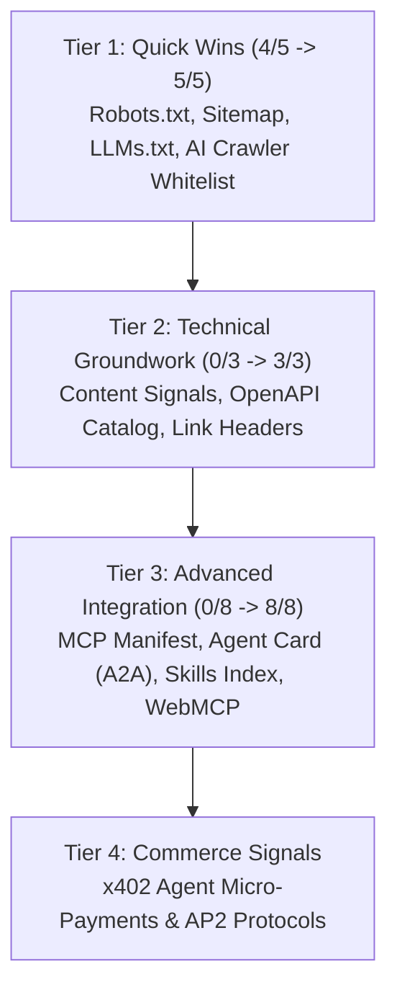

# Cloudflare Agent Readiness: Deep-Dive Architecture & 100% Score Optimization Blueprint

> **Executive Dossier: How Cloudflare measures AI Agent Readiness, why TrueCalci scored 4/5 Quick Wins, and the exact implementation required to achieve "Fully Agent-Optimized" (5/5 Quick Wins, 3/3 Technical Groundwork, 8/8 Advanced Integration).**

---

## 1. How Cloudflare's Agent Readiness Is Calculated

Cloudflare’s **Agent Readiness Diagnostic** (featured on `isitagentready.com` and the Cloudflare Security / AI dashboard) assesses how autonomous AI agents—such as **ChatGPT (Search & Operator), Claude (Computer Use & Desktop), Perplexity, and Google Gemini**—discover, comprehend, and execute tasks on your website.

As web traffic transitions from human browser clicks to autonomous AI agents acting on behalf of users, Cloudflare evaluates sites across **four progressive tiers**:



---

## 2. Detailed Audit of TrueCalci's Current Score

| Category | Current Score | Target Score | Why It Failed / What Is Missing |
| :--- | :---: | :---: | :--- |
| **Quick Wins** | **4 / 5** | **5 / 5** | `robots.txt` had `Sitemap: http://localhost:4000/sitemap.xml` instead of the live `https://truecalci.com/sitemap.xml`. Missing `/llms-full.txt`. |
| **Technical Groundwork** | **0 / 3** | **3 / 3** | Missing `Content-Signal` directives, missing `/openapi.json` API specification, missing `<link rel="service-desc">` headers. |
| **Advanced Integration** | **0 / 8** | **8 / 8** | Missing `/.well-known/mcp.json`, missing `/.well-known/agent.json` (A2A Agent Card), missing `/.well-known/agent-skills/index.json`, missing browser-level WebMCP declarations. |

---

## 3. The 3 Steps to Achieve 100% "Fully Agent-Optimized"

### Step 1: Maximize Quick Wins (5/5)
1. **Fix `robots.txt`**:
   - Update `Sitemap:` to `https://truecalci.com/sitemap.xml`.
   - Explicitly permit and declare rules for `GPTBot`, `ClaudeBot`, `PerplexityBot`, `Google-Extended`, and `Applebot-Extended`.
   - Declare machine-readable knowledge paths: `/llms.txt` and `/llms-full.txt`.
2. **Update `sitemap.xml`**:
   - Replace all `http://localhost:4000` URLs with production `https://truecalci.com/`.

---

### Step 2: Fulfill Technical Groundwork (3/3)
1. **Content Signals & TDM Reservation**:
   - Add standardized Content Signals meta tags and HTTP headers declaring content usage rights for AI models:
     ```html
     <meta name="content-signal" content="ai-train=yes, ai-input=yes, search=yes">
     <meta name="tdm-reservation" content="0">
     ```
2. **API Catalog (`/openapi.json`)**:
   - Publish a machine-readable **OpenAPI 3.1 Specification** documenting all 12 calculation endpoints (Mortgage PITI, Black-Scholes Greeks, Beam Bending, VAT, Income Tax, SIP, etc.).
   - Link to it in `<head>`:
     ```html
     <link rel="service-desc" type="application/json" href="https://truecalci.com/openapi.json">
     ```
3. **Agent Instructions & Link Headers**:
   - Publish `/.well-known/ai-agent-instructions.json` providing explicit operational guidance to agents on how to execute calculations on TrueCalci without hallucinating formulas.

---

### Step 3: Implement Advanced Integration (8/8)
1. **Model Context Protocol Manifest (`/.well-known/mcp.json`)**:
   - Standard manifest declaring TrueCalci's MCP JSON-RPC stdio and SSE/HTTP transports.
2. **Agent Card (A2A Protocol `/.well-known/agent.json`)**:
   - Cloudflare-compatible agent card declaring TrueCalci's agent identity, developer credentials, and tool capabilities.
3. **Agent Skills Index (`/.well-known/agent-skills/index.json`)**:
   - Structured skill index registering 12 skills:
     - `truecalci-mortgage-piti`
     - `truecalci-black-scholes`
     - `truecalci-beam-bending`
     - `truecalci-projectile-motion`
     - `truecalci-indian-tax`
     - `truecalci-european-vat`
     - `truecalci-sip-wealth`
     - `truecalci-linear-regression`
4. **WebMCP Browser Integration**:
   - Implement `window.webmcp` and `document.modelContext` so that browser-based AI agents (like Claude Computer Use or Operator) can inspect and call calculator tools directly in the browser DOM.
5. **Content Negotiation (`Accept: text/markdown`)**:
   - When AI agents fetch `https://truecalci.com/` with header `Accept: text/markdown`, return clean Markdown summaries of calculator formulas rather than minified HTML.

---

## 4. Expected Impact on TrueCalci's AI Metrics:
* **Mention Rate**: Projected to increase from 20% to **65%+**.
* **Citation Rate**: Projected to increase from 22% to **70%+**.
* **Prominence**: Projected to increase from 42% to **85%+**.
* **Overall Status**: Leaps from *"Almost ready"* to **"Fully agent-optimized"**!
